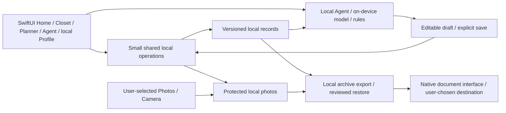

# V1 — Device-only architecture

October 5, 2026. Planning target for the [private MVP](../product/v1-release.md); no app code or service configuration is added. The user chose local clothing data, privacy by default, Apple-native capabilities and no unnecessary backend. A native iPhone app is the initial client.

## Boundaries

All core operations execute on one device. No API, Auth provider, hosted database, storage bucket, server job/queue, remote analytics, cloud AI or APNs transport is part of V1. Public store/support/privacy pages can use independent static hosting for distribution; the closet does not contact them to work.

## Small implementation proposal

| Responsibility | Apple-native/local proposal | Requirement |
| --- | --- | --- |
| UI | SwiftUI, system navigation/tab bar/forms/search/sheets | Home, Closet, Planner, Agent, local Profile as five equal-width icon-only native slots with destination accessibility names; Planner root, Closet segments only Pieces/Outfits/Themes, fourth-slot Agent full-screen task and Settings from the single Profile More menu; OS owns material/keyboard/accessibility. |
| Records | SwiftData local ModelContainer, CloudKit explicitly `.none` | Versioned migrations, stable IDs, validated local saves; preserve a suitable recovered existing store rather than rewrite it merely to use SwiftData. |
| Media | App-private Application Support files, relative media IDs, local thumbnails | Normalize selected media, remove unnecessary location metadata, protect originals/thumbnails; required media prepared before record commit. |
| Capture | PhotosPicker and native camera | Only user-selected images; manual classification with an accepted photo for new-piece save; permission requested at use. |
| Photo framing | Native SwiftUI/UIKit controls with local Core Image/Core Graphics transforms | Full-source Fit in 3:4 presentation; optional crop/rotate/reset; preserve protected source and normalized edit recipe/rendition. No model or AQD backend dependency. |
| Assistance | Foundation Models only when available; reason-specific Agent availability screen | Bounded confirmed metadata and owned IDs; local conversation/history, structured outfit/theme/plan drafts and reviewed local actions through the same save path. |
| Recovery | Versioned archive created locally; native Files export/import | Explicit destination, staged validation and reviewed full replacement; no auto-sync or merge engine. |
| Diagnostics | Local error handling and user-selected support diagnostics if needed | No closet/photo/note uploads or remotely collected activity by default. |

Apple documents that [CloudKit `.none`](https://developer.apple.com/documentation/swiftdata/modelconfiguration/cloudkitdatabase-swift.struct/none) disables managed sync. Disabling sync is separate from device backup: exclude AQD-owned stores, photos, drafts and derivatives from automatic backup and verify exclusions on device. Original images in Photos and exported archives are controlled by the user/system destination, not AQD. This is an AQD privacy decision, not a general property of SwiftData.

## Minimum data

Local closet ID; items with name/category/optional metadata/availability/archive flag and media references; outfits and ordered unique item memberships/favorite flag; plans/events/routines/resolved dated entries with local date/timezone/occasion/outfit reference/status; actual-wear records with stable item-set/day keys and minimal historical snapshots; themes/memberships, optional local profile/preferences, local Agent conversations/proposals, settings and recoverable drafts. There are no online users, public snapshots, social relationships, messages or sync outboxes. Theme/event/routine and local Agent/profile data are part of V1. Online identities, social projections and sync metadata are added only in V2.

Stable identifiers should survive future export and optional V2 association. Do not add networking abstractions, tenant models, pending remote operations or tombstone retention to V1 purely for future sync. Add only a schema version and the IDs/relationships needed by current local behavior.

## Persistence, recovery and privacy

Manual controls and approved suggestions share focused validation/save operations, not a generic distributed command framework. Validate owned/active references, unchanged draft revisions, dates and duplicate operations locally. A receipt follows durable save, never generated prose. Do not hold a database transaction open during photo selection or generation.

Photos and records do not share one file transaction. Prepare media in staging, finalize required files before storing references, retain the old image until replacement commits, and clean unused staging after known failure/restart. A failure must preserve usable records/drafts; an unreadable/newer store offers recovery and blocks empty overwrite.

Use app sandboxing and Apple file protection for records, media and temporary archives; inspect database sidecars/thumbnails as well as originals. Do not claim special encryption, an app lock or end-to-end encryption without an implemented contract. Minimize logs and strip unnecessary image metadata. No privileged credentials are needed in the app.

Export includes schema version, records, memberships, plan/history facts, local profile/preferences/Agent conversations and referenced photos with integrity checks. Explain sensitivity and the chosen external destination. Restore validates type/schema/references/media and bounded sizes in staging, previews exact replacement, requires explicit confirmation, and retains recoverable original data until a complete switch. Failed/cancelled/newer imports never overwrite the current closet. Erase clears records, local photos, drafts and derivatives after review; it cannot recall prior exported copies or delete original Photos library assets.

## Apple Intelligence limits

Apple's [Foundation Models guidance](https://developer.apple.com/documentation/foundationmodels/generating-content-and-performing-tasks-with-foundation-models) exposes an on-device model with runtime availability states. Eligibility, enablement, model readiness, region/language and OS affect availability. Model preparation can need networking before offline use. Bounded confirmed metadata supports small outfit drafts; availability alone is not evidence of clothing recommendation quality.

The [finite context window](https://developer.apple.com/documentation/foundationmodels/managing-the-context-window) includes instructions, inputs, schemas and outputs. Retrieve a small relevant set, validate IDs and preserve pins; do not send the entire closet or promise multi-month generation. Model errors/cancellation/stale selections return to manual work. No cloud fallback, background autonomous writes or current-weather knowledge is implied.

Use a capability decision rather than automatically deferring local features to V2. V1 includes verified Apple-native/on-device assistance where it works; manual entry remains complete on every supported device; the Agent tab stays visible but shows reason-specific unavailability when its model cannot run. Runtime availability and realistic device quality are implementation gates, not evidence delivered by this planning branch.

| Capability | V1 decision and fallback | Retained V2 extension |
| --- | --- | --- |
| Bounded text/metadata drafting | Foundation Models when eligible/ready; reviewed exact proposals or direct manual fallback. | Cloud research, external tools and server evaluation, with separate consent/budget. |
| Single-photo cleanup and editable tag proposals | Include verified local Vision foreground removal through [explicit action → preview → draft-only apply](../design/capture-photo.md#optional-local-background-removal), retaining the original and manual save. VN request: iOS17+; newer Swift request: iOS18+ ([Apple evidence](../references/local-background-removal.md)). This is independent of Foundation Models readiness and is class-agnostic: no garment-only extraction, perfect-edge or calibrated confidence guarantee. Editable tagging is a separate measured capability, not inferred from a mask. Keep unknown taxonomy/material/fit unknown. | Advanced visual analysis, batch/receipt/selfie import, multi-photo workflows and provider processing under V2-E01. |
| Voice transcript | Use a verified on-device speech path with microphone/speech permissions, locale/readiness checks, explicit recording and transcript review. For SFSpeechRecognizer, check [supportsOnDeviceRecognition](https://developer.apple.com/documentation/speech/sfspeechrecognizer/supportsondevicerecognition) and enforce [requiresOnDeviceRecognition](https://developer.apple.com/documentation/speech/sfspeechrecognitionrequest/requiresondevicerecognition). If unavailable, retain typing; never send audio to a cloud fallback. | Additional provider/cross-platform input only after privacy and service decisions. |
| Selected photo or owned-piece context | Native selection and confirmed metadata remain local; image processing is exposed only through a measured local capability. Text-model availability alone does not enable visual analysis. | External visual providers and richer intake retain their explicit requirements. |

No custom model, adapter training or media service is needed for the complete V1 baseline. Do not retain an unavailable button as a promise of working local processing; explain the limitation and preserve the draft/manual path.

## Costs and known limits

No recurring AQD backend bill is required by this architecture. Apple developer distribution, devices, optional static support/domain work and design tools can still cost money; zero backend is not zero total ownership cost. Do not purchase services based on historical V2 budget snapshots.

One installation holds the authoritative closet. Device loss, removal or corruption without an exported archive can lose data; there is no automatic restore or second-device sync. File protection is not protection against all access on an unlocked compromised device. Export may leave the device through a user-chosen provider. Storage/model latency varies by device. Test local restore and realistic photo-heavy lists before launch.

## Path to V2

V2 extends the same V1 private features, UI and persistent identities; it introduces online identity only by explicit opt-in, shows the exact local records/media being associated, preserves original local data and IDs until acknowledgment, and never publishes through sign-in. Local archives/schema migrations remain usable. The [V2 architecture](v2.md) adds account-scoped sync, backend authorization, publication/media, Inbox and operations as a separate implementation effort. Preparing this path does not enable network services in V1.

[LOCAL acceptance](../product/v1-release.md#local-acceptance) and [V1 designs](../design/v1-coverage.md) define verification. Current source/build, device privacy and model checks remain unverified.

## Complete local presentation and capability boundary

Local Profile stores optional user-entered identity and the private fit journal, with one More entry into Add fit/Edit profile/Style/Wear insights/Settings; no online username or public projection. Shared onboarding/Settings preference drafts include explicit goals/occasions/style/fit-comfort/colors plus optional height/self-described body shape. Normalize height units, retain explicit refusal versus unanswered state and purpose-specific body-use consent (off for missing/legacy values); versioned save/export/restore/erase protects all fields. New Agent requests need both Style context and body-use permission before including optional body details. Settings persists System/Light/Dark and local data/help controls. Agent conversations/drafts/results are local, separate from future human Inbox. On-device model/rules may read bounded authorized records; local writes require exact current proposal approval and trusted validation. General model text cannot silently mutate records.

Manual themes, recurring plans/events/trips/packing and factual wear insights require no server. Assisted long-range plans require bounded generation and full review; inability to generate does not disable their manual paths. Current weather, online research/social actions, remote feedback and unsupported image/speech processing stay V2/capability-gated. V1 is complete when its supported local journeys and honest fallback states pass, not when every future AI hypothesis is enabled.

## Onboarding and tour state

Keep saved-preferences completion, explicit question answer/refusal state, tour version/step/skip and restore destination in local preferences. The entered questionnaire has no skip action; cancellation/Explore first is not a completed-preferences flag. Number/progress all seven shared onboarding/Settings steps, preserving drafts and true return destinations. The tour uses read-only preview fixtures with no writes to real wardrobe stores. Skip/replay/finish preserves drafts and returns to the correct entry. Focus is confined to the tour presentation; larger text scrolls. V2 retains the state and shows only contextual connected-feature guidance after opt-in.

Agent navigation and capability gating follow [Agent availability](../features/agent.md#agent-availability-and-provider-selection). Keep the destination visible; gate model-dependent conversation/generation before composer/send. V2 provider selection is explicit opt-in and has no V1 service dependency.
