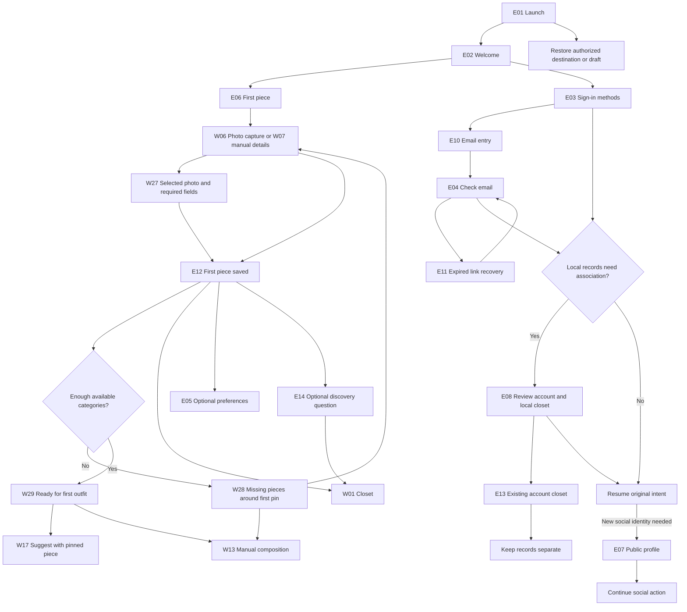

# Entry and identity

Phase scope: shared native/visual rules apply to both phases. Five-destination base navigation applies to both phases. Full-app E/W/P/S/A/I/U routes, online identity and connected states are V2 references. Complete private themes/planning/Agent are retained in V1. V1 uses only its [dedicated local flow](v1-flow.md) and [complete local release](../product/v1-release.md); [V2 requirements](v2-requirements.md) own connected and extension coverage.

The first trust milestone is one privately saved piece; the first styling milestone is a usable saved outfit. Exploring onboarding must not require a profile, style quiz, media permission, notification permission or AI availability. Saving a new piece needs a photo, name and category. The [V2 flow review](v2-flow.md) connects capture to first-outfit readiness, Home, planning/wear and optional social identity.

## Routing rules

- Welcome has one primary action: start a private closet. Returning-account access is a secondary text action. No ambiguous Explore link in the brand header.
- First piece opens the standard picker/editor. Selected photos reach W27 review; manual classification uses W07; a new-piece save needs an accepted photo, name and category. Broad photo-library access is not required. Skip opens the empty private closet. Saving shows E12 only after persistence succeeds, using the actual saved item.
- E12's primary Build my first outfit carries the saved piece as a pin into W28 (missing categories) or W29 (ready). Secondary Open my closet remains available. Missing-category capture returns to that task after save/cancel without repeating setup. A partial manual look is allowed; complete suggestions need the requested available categories. Optional preferences stay off this path; the acquisition survey is V2-E15 and its entry is hidden in V1 and the V2 connected core until that extension is enabled.
- Today is derived from records: empty closet → S16; pieces but missing categories → first-outfit guidance linking W28; enough pieces with no saved outfits → S48; saved outfits without today's plan → S17; a planned look → S15. Returning users restore their selected Home mode; local use never forces auth.
- Preferences may be bypassed before entering the questionnaire; Explore first does not mark preferences complete. Once entered, each question requires an explicit answer or No preference/refusal, with cancellation preserving the draft and true source. No style is preselected. [Personalization](onboarding-personalization.md) owns question/completion rules; do not replay bypassed entry every launch.
- E03 offers Apple or email as working defaults, pending provider selection. E10 isolates email entry from provider selection. Auth cancellation returns to the initiating task with drafts intact.
- Email links are tied to the initiating transaction. Resend uses the real server deadline. Offline verification offers retry; expired/consumed links use E11. No account-enumeration copy. Verification and submission have accessible progress, duplicate protection and preserved input.
- After authentication, an existing account skips profile creation. Local association appears only for unresolved local records. Show the real destination identity, actual affected records and exact supported durability behavior. Signing in never publishes anything.
- If account/local ownership conflicts, E13 keeps records separate. Never silently merge, overwrite or move ownership. A safe merge remains a service-policy gate.
- Public profile setup is needed only for the first social action requiring it. Explicitly identify public name/username; do not imply all wardrobe records become public. Skipping returns to private use.
- E09 is camera-denial recovery, not a compulsory permission preflight. Photos selection remains scoped to the system picker. Permission is requested only when the user chooses Camera.

## Visual system

Entry retains system typography, cool neutral/graphite surfaces and crisp blue actions. The welcome composition pairs an outfit photograph with piece photographs to explain the product visually. All images are design references, not an implied inventory belonging to a new user.

The Paper page 00 entry introduction, action stack, hero, identity choice and read-only identity masters reuse the app’s shared type, fields, actions, icons and rows. Forms use quiet opaque native fields; search and composer glass is not copied onto identity fields. Only one primary task action dominates each step; secondary choices remain visible with 44-point targets. Longer copy and accessibility text scroll rather than shrinking.

## Acceptance for implementation

Check fresh install, returning private user, returning signed-in user, expired session, cancelled provider, invalid email, delayed/failed/resend-limited link, consumed link, denied camera, missing-photo validation, first-save failure, username conflict, interrupted association and account collision. Verify return intent, stable local IDs, no premature success, VoiceOver focus, keyboard insets and accessible text on devices. Static Paper screens do not prove these behaviors.

## Acquisition question — V2

The following optional survey design is deferred by the [release boundary](../product/v2-backlog.md); omit its entry point in V1 and the V2 connected core until V2-E15 is enabled.

Future E12 offers “How did you find AQD?” as an optional row linking to E14. It never interrupts capture or blocks opening the closet. E14 offers friend/family, Instagram, TikTok, App Store, search engine, something else and do not remember. No answer is preselected; Continue enables after one choice. Skip and Not now return to Closet. Preserve an answered/skipped dismissal so the question is not repeated.

The intended analytics event is `onboarding_acquisition_answered`, with `source` enum `friend_family | instagram | tiktok | app_store | search_engine | other | unknown` and `schema_version: 1`. This is self-reported discovery, not verified attribution. Include no email, username, free text, or wardrobe data. Respect the app’s analytics preference; service/provider implementation remains unselected. Skip records only local dismissal and does not manufacture an attribution answer. No analytics collection was implemented by this design pass.

## Welcome motion

E02 uses an overlapping editorial hero with two piece cards, then E06 receives the same illustrative shirt in a focused first-piece frame. The [entry motion contract](entry-motion.md) owns timing, interruption, native navigation fallback, Reduce Motion and performance acceptance. Both actions stay available throughout.

## Private-start introduction · L61

Use a small decorative shirt-and-sneakers composition from the existing Welcome atlas, rather than another paragraph or a dense checklist. Keep the heading, two lines of capture guidance, and a compact lock-marked privacy note: local storage, archive export in Settings, and the risk from device loss/app deletion. The image is illustrative, never selected or saved wardrobe data. Photo/name/category validation belongs to capture. Request media permissions only when Choose photo/Take photo is used.

Personalize my closet is the sole primary and opens the shared questionnaire; Take the tour stays a plain secondary in the shared 12-point action stack. Explore first stays at the bottom with safe-area clearance. Keep the illustration static and decorative for VoiceOver; on small screens/larger text, shrink or omit it before compromising readable copy or touch targets, and let content scroll with the footer in flow. Missing artwork leaves the instructions/actions available. Dark mode uses the existing Welcome photographic ground and semantic night text/control tokens.
